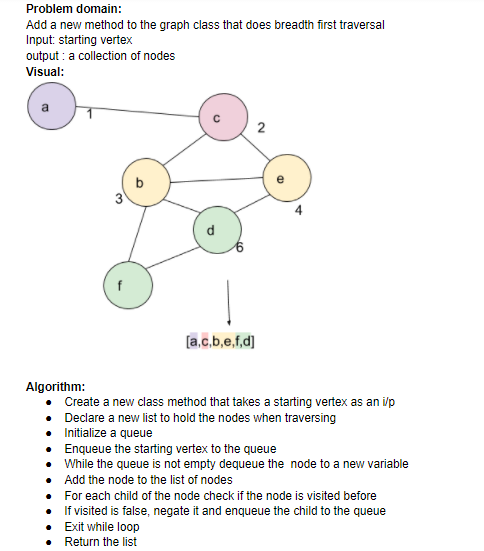

# Graphs

A graph is a non-linear data structure that can be looked at as a collection of vertices (or nodes) potentially connected by line segments named edges.

## Challenge

Implement a Graph
class 37 :
Extend your graph object with a breadth-first traversal method that accepts a starting node. Without utilizing any of the built-in methods available to your language, return a collection of nodes in the order they were visited.  

## Approach & Efficiency

Used a Map object to represent the adjacency list that describes the graph.

## API

methods:
AddNode()
<!-- Adds a new node to the graph
Takes in the value of that node
Returns the added node -->
AddEdge()
<!-- Adds a new edge between two nodes in the graph
Include the ability to have a “weight”
Takes in the two nodes to be connected by the edge
Both nodes should already be in the Graph -->
GetNodes()
<!-- Returns all of the nodes in the graph as a collection (set, list, or similar) -->
GetNeighbors()
<!-- Returns a collection of edges connected to the given node
Takes in a given node
Include the weight of the connection in the returned collection -->
Size()
<!-- Returns the total number of nodes in the graph -->
breadthFirst()

## whiteboard

Big O:
time O(n^2)  
space O(n)

