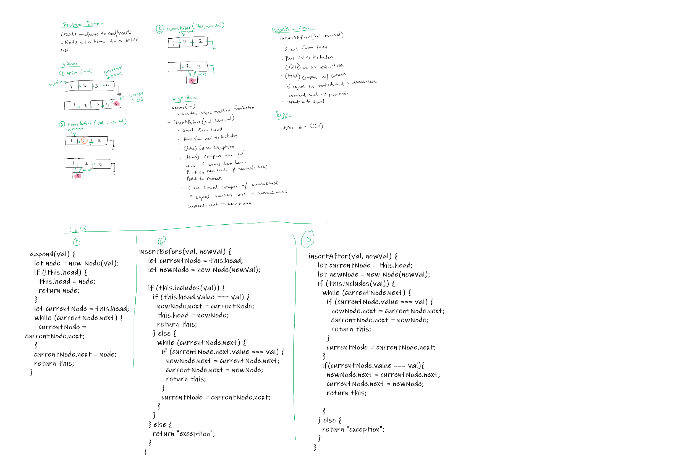
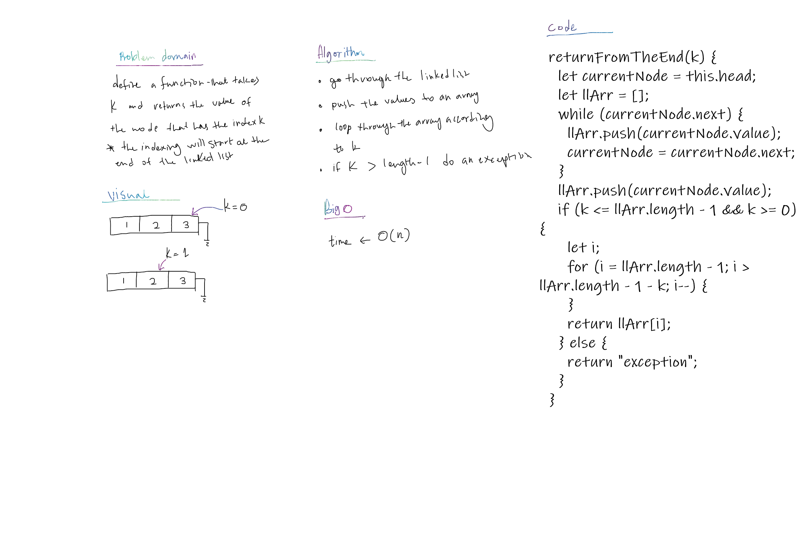

# Singly Linked List

A linear data structure that is a sequence of Nodes that are connected/linked to each other, where every node references the next one. Nodes are the individual items/links that live in a linked list. Each node contains the data for each link.

## Language: `JavaScript`

## Challenge

Create a Linked list that you can be able to add nodes to, check if it includes a certain value and convert it into a string for visual presentation.

## Approach & Efficiency

O(n) Time performance

## API

- insert(): inserts a new node to the linked list
- includes(): checks if a certain value exists in the linked list
- toString(): represents the linked list and its values as a string
- append(): inserts a new node to the end of the linked list.
- insertBefore(): inserts a new node before the first found node that has a value equal to a given value
- insertAfter(): inserts a new node after the first found node that has a value equal to a given value
- returnFromTheEnd(): Returns the node’s value that is k from the end of the linked list.

## solution

