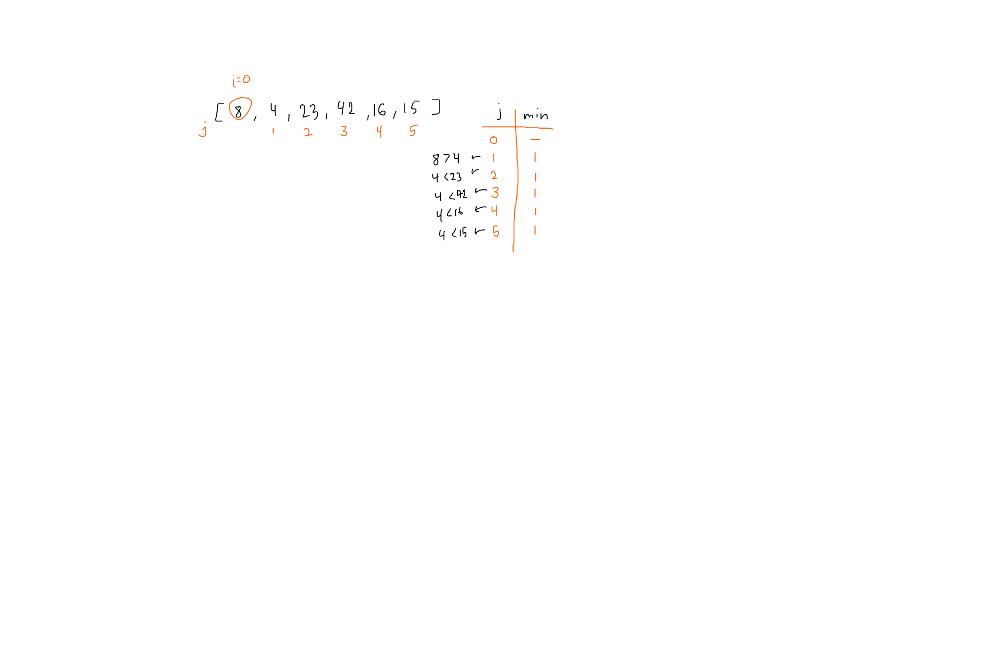
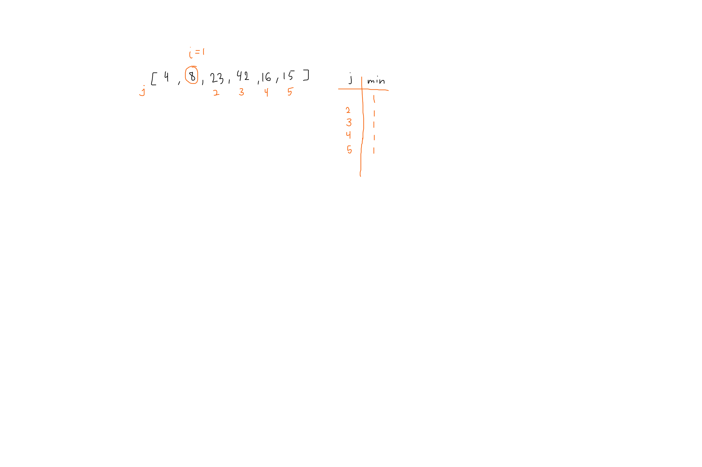
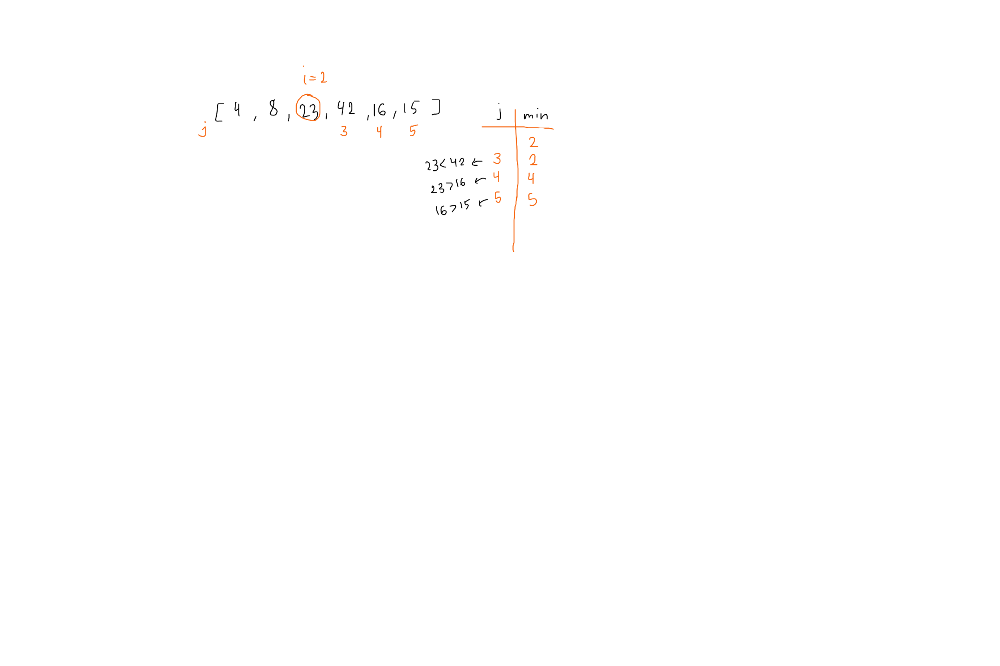
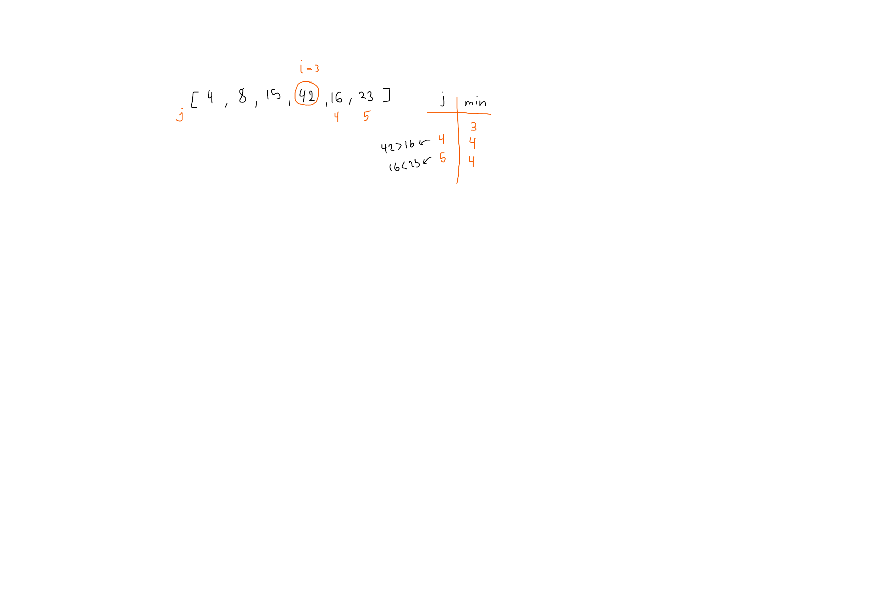
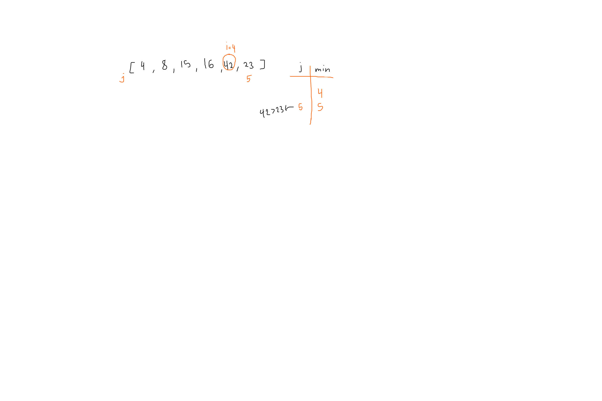

# Selection Sorting

Selection sorting is done by starting from the first element and comparing it to the rest of the elements in the array, finding the minimum value and swapping it with the current value.

## Pseudocode

```Pseudocode
SelectionSort(int[] arr)
    DECLARE n <-- arr.Length;
    FOR i = 0; i to n - 1
        DECLARE min <-- i;
        FOR j = i + 1 to n
            if (arr[j] < arr[min])
                min <-- j;

        DECLARE temp <-- arr[min];
        arr[min] <-- arr[i];
        arr[i] <-- temp;
```

## Tracing

input array `[8,4,23,42,16,15]`

### pass 1



### pass 2



### pass 3



### pass 4



### pass 5



### result

[4,8,15,16,23,42]

## Efficiency

Time: O(n^2)

Space: O(1)
No additional space is being created.
