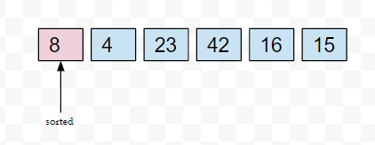
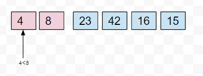
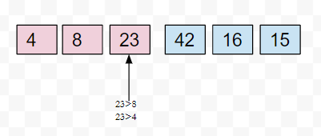
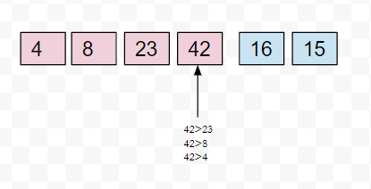
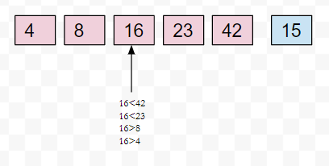
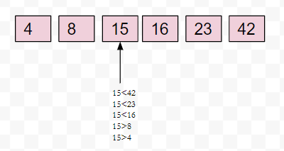

# insertion Sort

Insertion sort is done by assuming that the first element is sorted and moving to the next element and comparing it with the previous elements and then inserting it in it's place, then moving to the next element and so on.

## Pseudocode

```Pseudocode
 InsertionSort(int[] arr)
  
    FOR i = 1 to arr.length
      int j <-- i - 1
      int temp <-- arr[i]
      WHILE j >= 0 AND temp < arr[j]
        arr[j + 1] <-- arr[j]
        j <-- j - 1
      arr[j + 1] <-- temp
```

## Tracing

input array `[8,4,23,42,16,15]`

### pass 1



### pass 2



### pass 3



### pass 4



### pass 5



### pass 6



### result

[4,8,15,16,23,42]

## Efficiency

Time: O(n^2)

Space: O(1)
