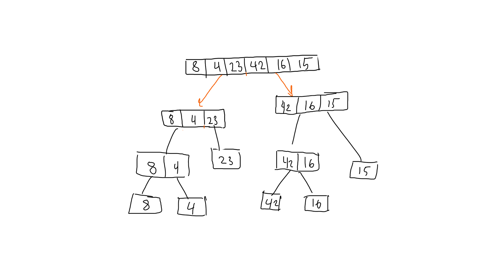
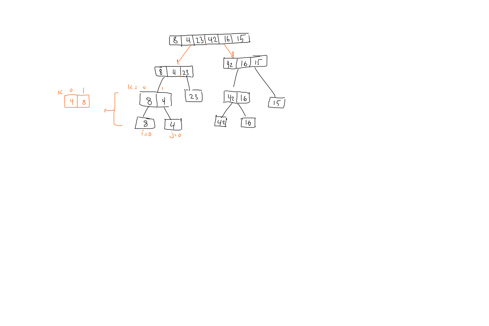
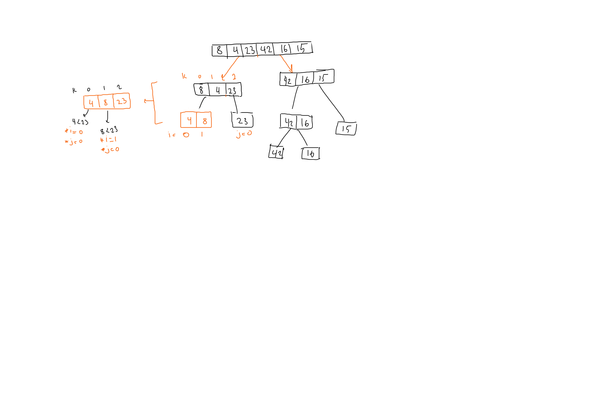
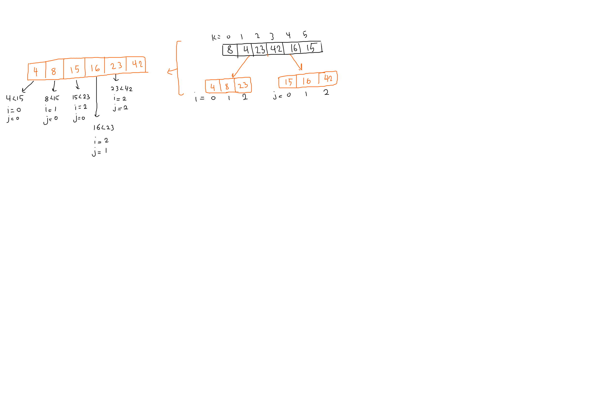

# Merge Sorting

Merge sort algorithm depends on spliting the original array in the middle and split these arrays further until we have an array of one element. after that the each two arrays at the same level are merged after sorting, until the whole array is sorted.
The merging function will assume that the subarrays are sorted and merge them by comparing elements one by one from the two arrays, when it finds the lower value it inserts it into a bigger array and increases the index in the subarray the value was found in and repeats. until the two subarrays are merged.

## Pseudocode

```Pseudocode

ALGORITHM Mergesort(arr)
    DECLARE n <-- arr.length
    if n > 1
      DECLARE mid <-- n/2
      DECLARE left <-- arr[0...mid]
      DECLARE right <-- arr[mid...n]
      // sort the left side
      Mergesort(left)
      // sort the right side
      Mergesort(right)
      // merge the sorted left and right sides together
      Merge(left, right, arr)

ALGORITHM Merge(left, right, arr)
    DECLARE i <-- 0
    DECLARE j <-- 0
    DECLARE k <-- 0

    while i < left.length && j < right.length
        if left[i] <= right[j]
            arr[k] <-- left[i]
            i <-- i + 1
        else
            arr[k] <-- right[j]
            j <-- j + 1
        k <-- k + 1

    if i = left.length
       set remaining entries in arr to remaining values in right
    else
       set remaining entries in arr to remaining values in left

```

## Tracing

input array `[8,4,23,42,16,15]`

## dividing



## merging

  
  s

the same process will be applied simultaneously on the right side and the last round will look like this.  



### result

[4,8,15,16,23,42]

## Efficiency

The problem with this algorithm is that it will cause the program to crash when handling long arrays because of the recursion (stack overflow).

Time: O(n)=> for dividing the arrays
      O(log n) => for merging the arrays
      O(n log n) => over all algorithm

Space: O(n)
