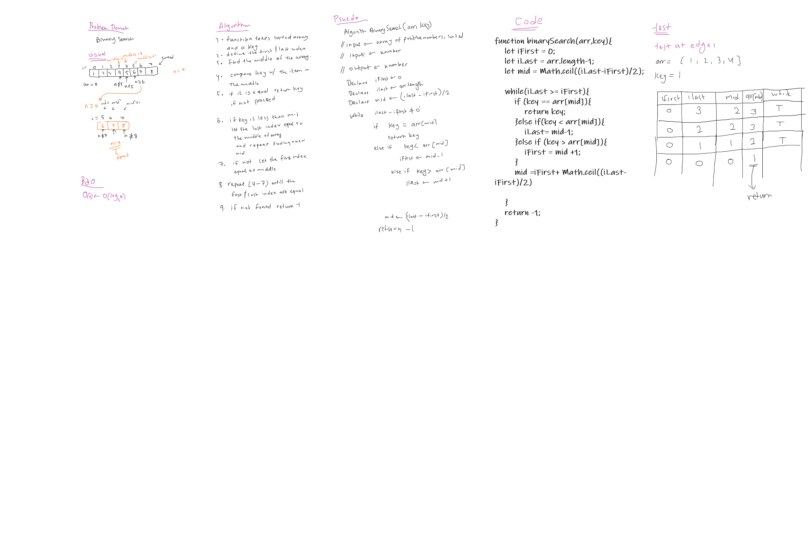

# Binary search

## Challenge

a function which takes in 2 parameters: a sorted array and the search key. Without utilizing any of the built-in methods available to your language, return the index of the array’s element that is equal to the search key, or -1 if the element does not exist.

## Approach & Efficiency

compare The key with the middle element if it is equal to it return it, if not the range will be reduced.
start at the mid point to the end of the array if the key is greater than the mid point and find a new mid point
or if it is smaller start from the previos start point to the mid point. repeat until found or unitl the start point becomes larger than the end point

it is important for the array to be sorted.
for larger arrays it cuts down the excution time very significantly compared to normal search.

## Solution
<!-- Embedded whiteboard image -->

