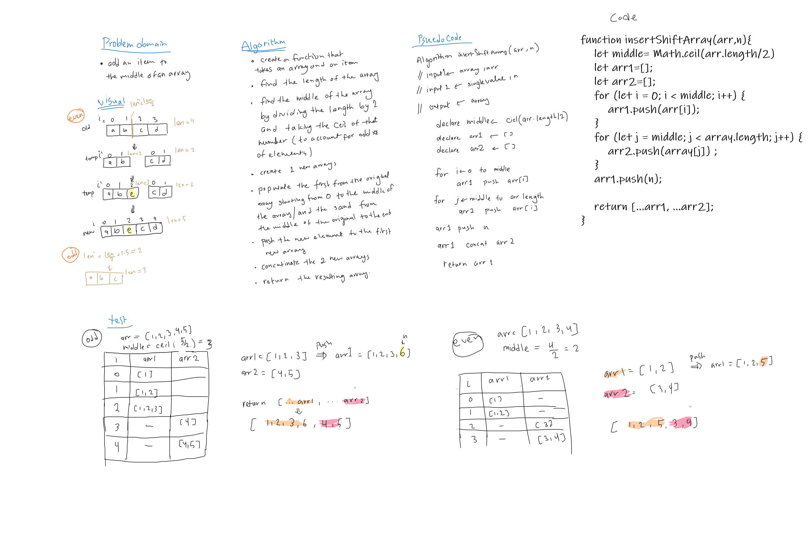

# Reverse an Array

a function called which takes in an array and the value to be added in the middle without utilizing any of the built-in methods in JavaScript.

## Challenge

a function called which takes in an array and the value to be added in the middle without utilizing any of the built-in methods in JavaScript.

## Approach & Efficiency

split the array from the middle into two new arrays then add the value to the end of the first part. then join the two new arrays and return the resulting array.

It works for both odd and even number of elements.

## Solution
<!-- Embedded whiteboard image -->

