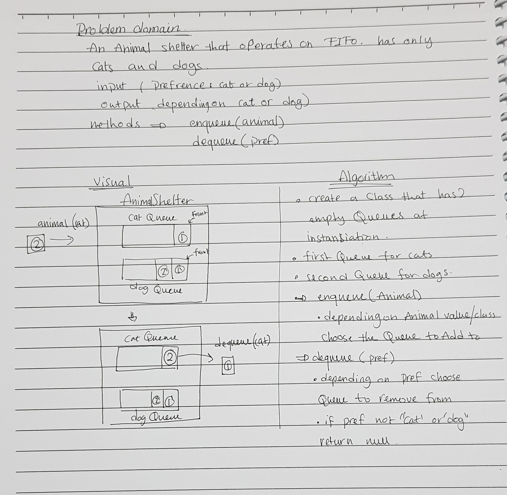

# FIFO animal shelter

A shelter for cats and dogs that operates on FIFO, where a person can adopt a cat or a dog and the cat that first entered the shelter will be adopted first.

## Challenge

Create a class called AnimalShelter which holds only dogs and cats. The shelter operates using a first-in, first-out approach.

## Approach & Efficiency

split the array from the middle into two new arrays then add the value to the end of the first part. then join the two new arrays and return the resulting array.

It works for both odd and even number of elements.

## Solution
<!-- Embedded whiteboard image -->

