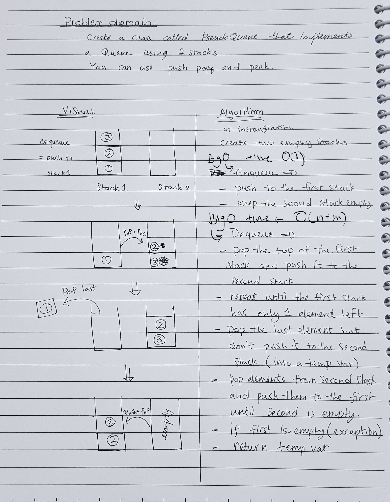

# queue with stacks

implement a queue interface using two stacks, where it will enqueue and dequeue based on FIFO and LILO.
The Queue will only have two mehods implemented enqueue and dequeue.

## Language: `JavaScript`

## Challenge

implement a queue interface using two stacks, where it will enqueue and dequeue based on FIFO and LILO. using previously created stck class and its push pop and peek methods

## Approach & Efficiency

Enqueue has the time effeciency of O(1)
Dequeue has the time eeffeciency of O(n+m)

## API

Queue methods:

* enqueue.
* dequeue.

## solution

