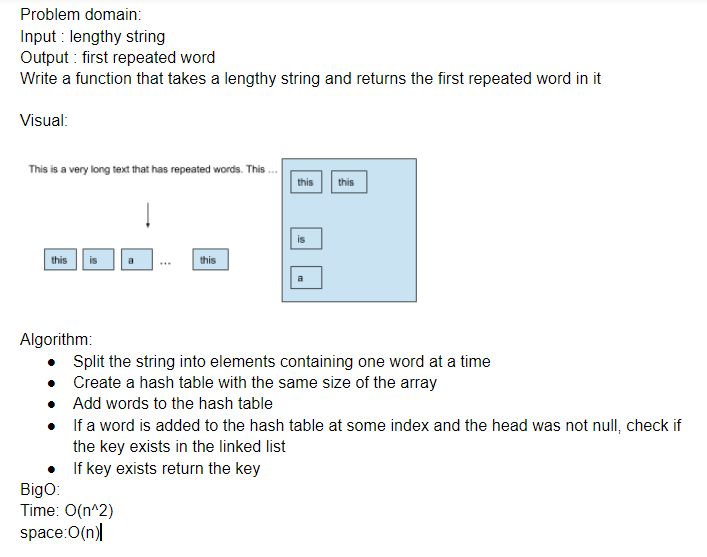

# Repeated Words

A function that returns the first repeateed word in a string.

## Challenge

write a function that takes a lengthy string and returns the first repeated word without utilizing built in functions.

## Approach & Efficiency

will use a hash table that has the size as the number of words. using hash table methods will find if a key is duplicated and return the first result. best case senario it will go through two words, worst case it will go through all words and not find a duplicate.
Time O(n^2)
space O(n)

## Solution
<!-- Embedded whiteboard image -->

