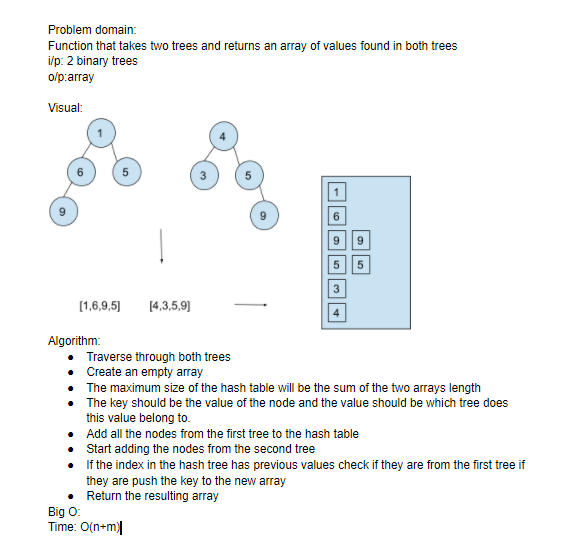

# Repeated Words

A function that returns the first repeateed values in two binary trees.

## Challenge

write a function that takes two binary trees and returns an array with the repeated values in both of them.

## Approach & Efficiency

will use a hash table that has the size as the number of nodes in each binary tree. using hash table methods will find if a key is duplicated and check if it is from the same tree or from the other tree. when a repeated value is found it is pushed to a return array.
Time O(n+m)
space O(2(n+m))

## Solution
<!-- Embedded whiteboard image -->

